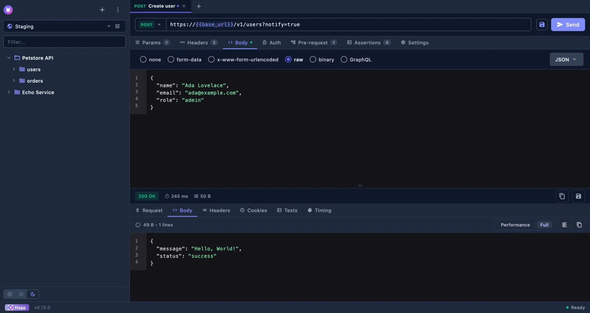
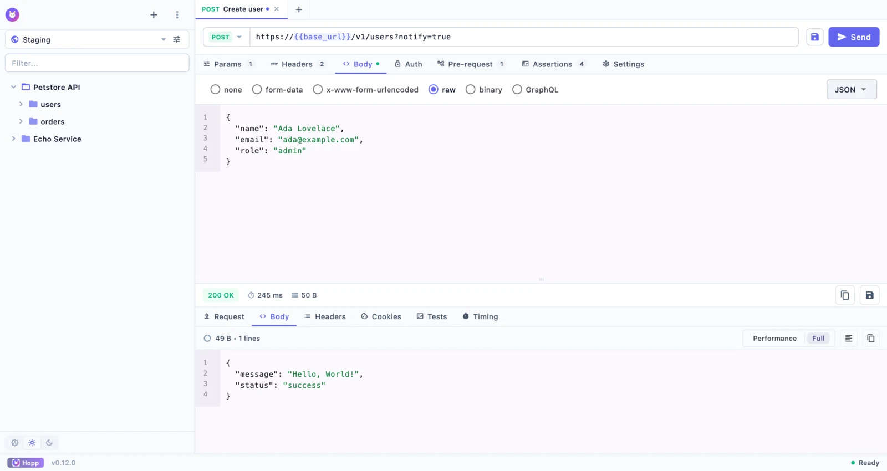
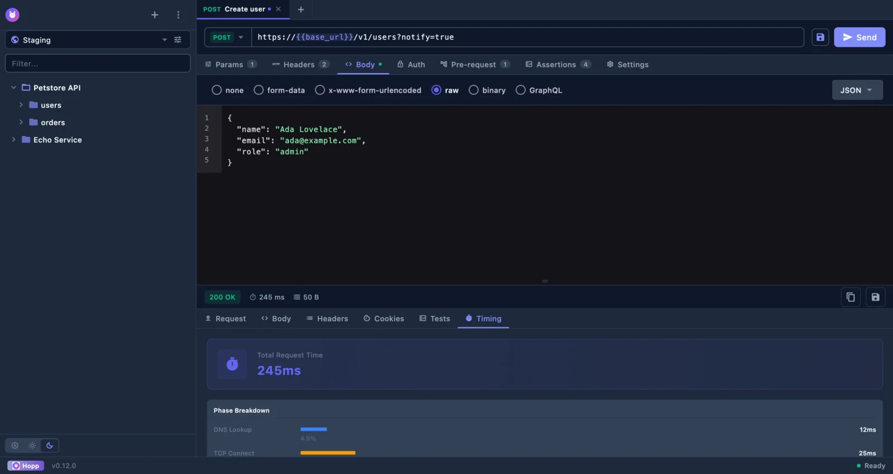
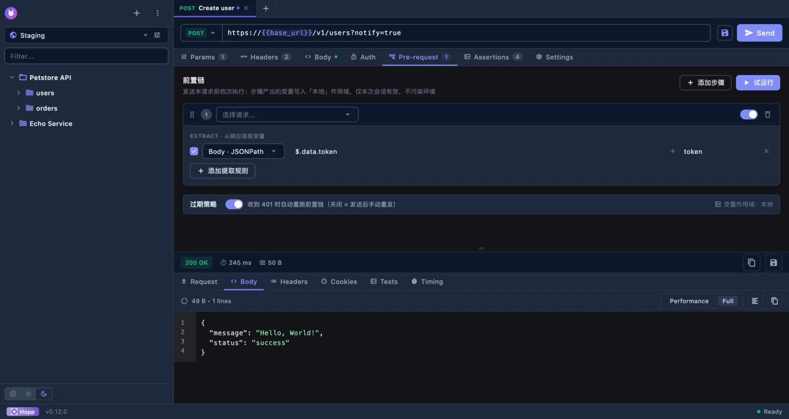
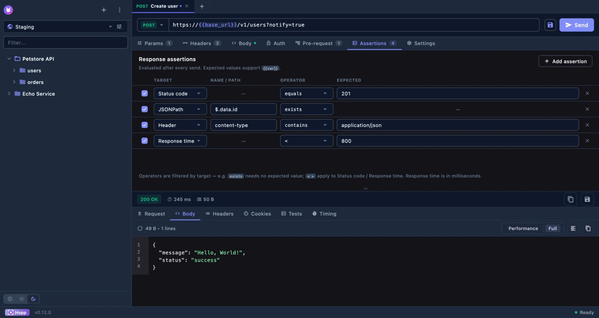
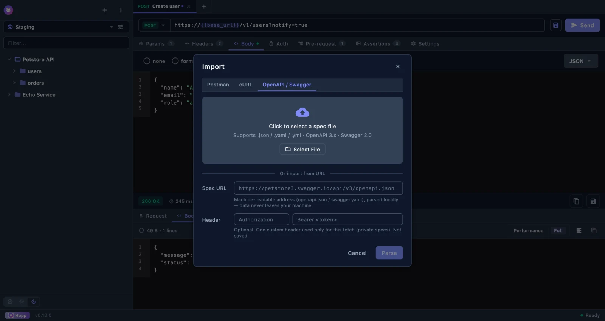

# 🐰 Hopp

> Local-first, private AI API workbench — keep your data on your machine

[简体中文](./README.zh-CN.md) | English

[](https://github.com/scottli139/hopp/actions)
[](https://opensource.org/licenses/MIT)
[](https://flutter.dev)
[](https://dart.dev)
[](https://www.moonshot.cn)

**🤖 100% AI Developed** — Built with [Kimi Code CLI](https://www.moonshot.cn/) · Powered by [Kimi K3](https://www.moonshot.cn/) & [DeepSeek V4 Pro](https://platform.deepseek.com/)

**Positioning** — not a Postman clone: Hopp puts AI convenience on top of local API tooling, private by default.

---

## ✨ Features

- 🔥 **Lightweight & Fast** - Native performance with Flutter
- 🖥️ **Cross-Platform** - macOS, Windows, Linux
- 📝 **Request Editor** - Support for Params, Headers, Body (JSON, Form, Text)
- 🗂️ **Collections** - Organize requests into folders
- 📑 **Multiple Tabs** - Work with multiple requests simultaneously
- 🌓 **Dark Mode** - Support for light/dark/system themes
- 🌍 **Internationalization** - English and Chinese support
- 📊 **Response Viewer** - View response body, headers, and timing information
- 🔒 **HTTPS Certificate** - View SSL/TLS certificate details
- ⏱️ **Timing Analysis** - DNS, TCP, TLS, TTFB, Download time breakdown
- ⚡ **Optimized Display** - Virtualized rendering for large responses (>50KB)
- ⌨️ **Keyboard Shortcuts** - Cmd+N, Cmd+Enter, Cmd+S, Cmd+W, etc.
- 🧪 **UI Test Mode** - Built-in HTTP command server for automated testing
- 🔐 **Environment Variables** - Multi-environment + globals with `{{var}}` interpolation, dynamic variables, and secret masking
- 🔗 **Pre-request Chain** - Declarative login → token extraction (no JS sandbox), 401 auto-retry, variable transforms (sha1/aes/hmac…)
- 📥 **OpenAPI/Swagger Import** - 3.0/3.1 + 2.0, JSON + YAML, from file or URL, with pick-and-preview
- ✅ **Lightweight Assertions** - Status/Header/Body/JSONPath/response-time rules with a Tests result tab
- 📤 **CLI Export & Runner** - Full-fidelity `.hopp.json` export + `hopp run` for CI (console/JUnit/JSON reporters)
- 🔒 **Encrypted Storage** - Hive boxes encrypted at rest (AES), secrets never stored in plaintext

---

## 🧭 Direction

Hopp is moving from "another Postman clone" to a **local-first, private AI workbench**. Delivered so far:

- **Environment variables** ✅ — reusable `{{var}}` with scopes (local > environment > global), dynamic variables, secret masking (v0.8.0)
- **Pre-request chain + variable transforms** ✅ — login → token, password sha1/aes encryption, declarative (no JS sandbox) (v0.10.0)
- **Tier 0 deterministic import** ✅ — OpenAPI/Swagger file or URL import with pick-and-preview (v0.11.0)
- **Lightweight assertions + CLI** ✅ — status/header/body/JSONPath rules with Tests tab, `.hopp.json` export, `hopp run` for CI (v0.12.0)

Planned next:

- **Tier 1 local model** (M8.5) — Ollama / LM Studio: explain responses, AI-generated assertions, natural-language request building
- **Tier 2 BYOK cloud** (M8.6) — opt-in cloud providers with a first-send privacy gate

> See [PRD](docs/PRD.md) and [FEATURE_UI_DESIGN](docs/FEATURE_UI_DESIGN.md).

---

## 📸 Screenshots

**Dark & light themes** — request editor with params, headers, JSON body, and the response viewer.




**Timing breakdown · pre-request chain · response assertions · OpenAPI import**

 
 

---

## 🚀 Quick Start

### Prerequisites

- [Flutter](https://flutter.dev/) 3.35+
- [FVM](https://fvm.app/) (recommended for version management)
- [Dart](https://dart.dev/) 3.6+

### Development

```bash
# Clone the repository
git clone https://github.com/scottli139/hopp.git
cd hopp

# Install FVM (if not installed)
dart pub global activate fvm

# Use project Flutter version
fvm use

# Install dependencies
fvm flutter pub get

# Run development
fvm flutter run -d macos
```

#### China Mirror Setup

For developers in mainland China, configure Flutter mirrors:

```bash
# Add to ~/.zshrc or ~/.bashrc
export PUB_HOSTED_URL=https://pub.flutter-io.cn
export FLUTTER_STORAGE_BASE_URL=https://storage.flutter-io.cn
```

### Build

```bash
# Build for macOS
fvm flutter build macos --release

# Build for Windows
fvm flutter build windows --release

# Build for Linux
fvm flutter build linux --release
```

---

## 🏗️ Architecture

```
hopp/
├── cli/                 # hopp run CLI runner (Dart, shares lib/ pure-Dart core)
├── lib/
│   ├── models/          # Data models (Freezed + Hive)
│   ├── providers/       # Riverpod state management
│   ├── services/        # HTTP & Storage services (assertions, pre-request chain, import/export)
│   ├── theme/           # Design system tokens (single source of truth)
│   ├── widgets/         # UI components
│   ├── screens/         # App screens
│   ├── utils/           # Utilities
│   └── l10n/            # Localization
├── macos/               # macOS platform code
├── windows/             # Windows platform code
├── linux/               # Linux platform code
├── test/                # Unit, widget, and CLI tests
└── docs/                # Documentation
```

---

## 🛠️ Tech Stack

- **Framework**: Flutter 3.35.x, Dart 3.9+
- **State Management**: Riverpod 2.x
- **HTTP Client**: Dio 5.x
- **Local Storage**: Hive + SharedPreferences
- **UI Components**: Material Design 3
- **Code Generation**: Freezed, json_serializable
- **Testing**: Mockito, integration_test, Peekaboo

---

## 📝 License

[MIT License](./LICENSE)

---

## 🤝 Contributing

Contributions are welcome! Please read [CONTRIBUTING.md](./CONTRIBUTING.md) for details, and be respectful of our [Code of Conduct](./CODE_OF_CONDUCT.md).

---

<p align="center">Built with ❤️ by AI · Powered by Kimi</p>
