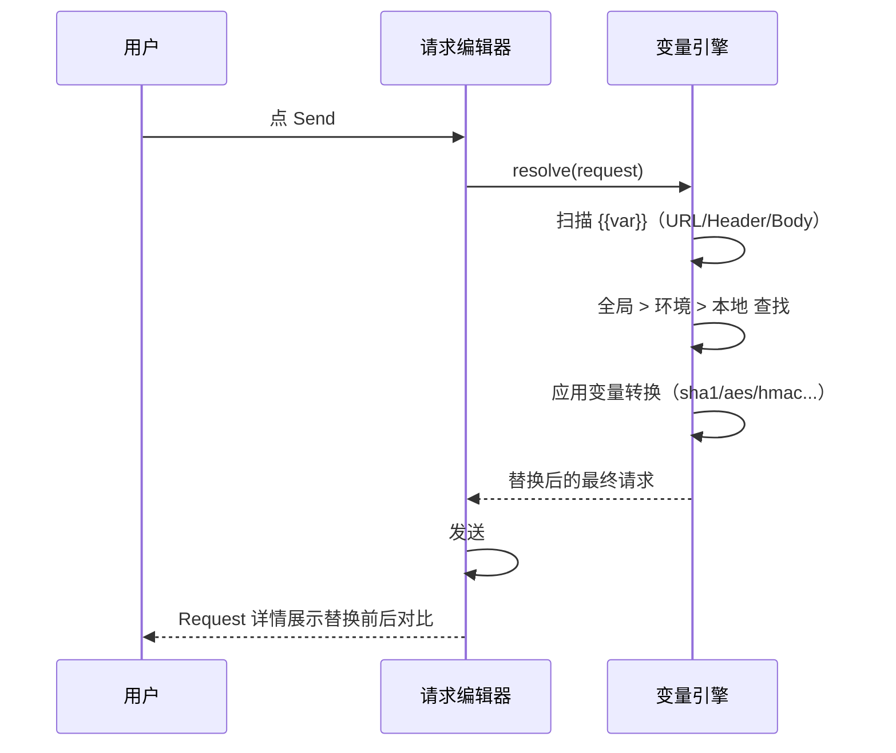
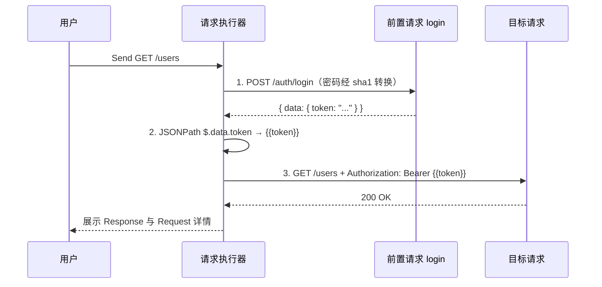
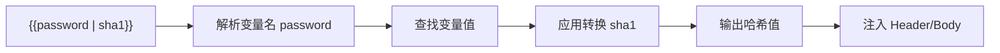
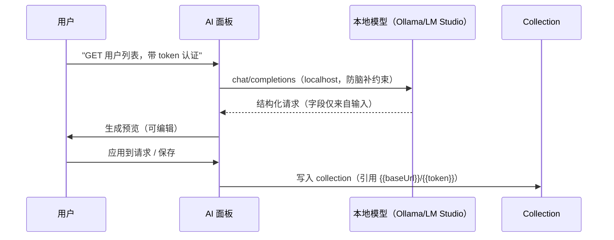
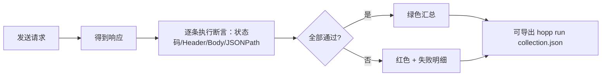
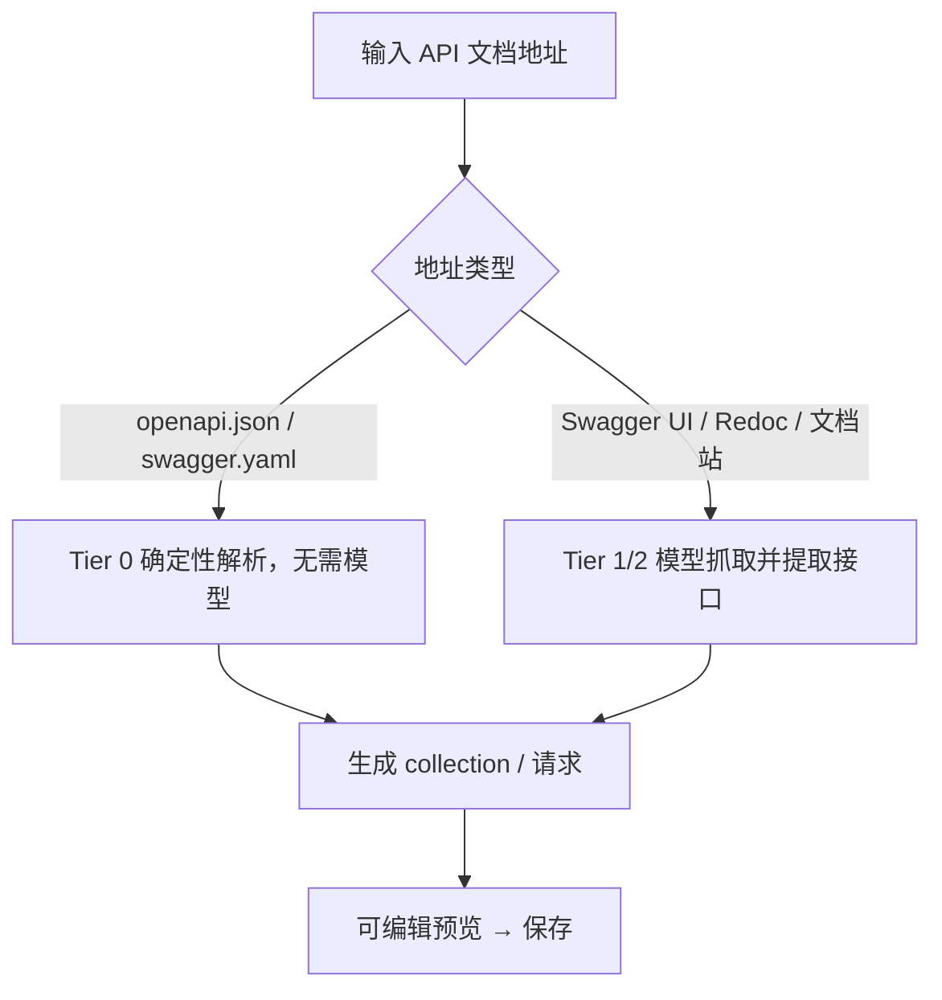

# Hopp 新功能界面与交互设计

> 本文档描述 v0.8.0 战略转型后的新功能界面与交互。高保真界面稿见 [design/hopp-new-features.html](./design/hopp-new-features.html)（浏览器打开）。

---

## 1. 设计原则

- 延续现有设计语言：Indigo 主色 `#6366F1`、11–12px 紧凑字体、Menlo 等宽、32px URL 栏、28px Tab、卡片式设置。
- **声明式优先**：能配置的不写脚本；能看得见每一步的不做黑盒。
- **AI 是增强不是依赖**：任何 AI 调用失败/超时/未配置都回退，不阻断「发请求」主流程。
- **可保存、可复跑**：AI 产出落到 collection / 环境 / 断言，而非一次性聊天。

## 2. 屏幕地图

| 功能 | 屏幕/入口 | 关键交互 |
|------|-----------|----------|
| 环境变量（M6） | 顶部环境切换器 + 环境管理对话框 | 切换即解析；secret 脱敏/👁/复制 |
| 变量转换（F8.3） | Headers/Body 行内值 + 转换选择器 | 点值 → 选算法 → 实时预览 |
| 预请求链（F8.2） | 请求设置里的「前置请求链」面板 | 配置 login + 提取 + 注入 |
| 认证（F8.1） | Auth Tab | 选类型 → 引用变量 |
| AI 助手（F9） | 主区新增「AI」Tab / 侧面板 | 自然语言 → 生成预览 → 应用 |
| 轻量断言（F4） | Response 区断言面板 | 发送后自动跑、行级通过/失败 |
| OpenAPI 导入（F9 Tier 0） | 导入对话框 | 选文件 → 解析预览 → 生成 collection |

## 3. 关键交互流程

### 3.1 环境变量解析（发送前）



### 3.2 预请求链（登录 → token）



### 3.3 变量转换（声明式管道）



### 3.4 AI 自然语言建请求



### 3.5 OpenAPI / Swagger 导入（Tier 0）

```mermaid
flowchart TD
    A[选择 openapi.json] --> B[解析 paths/operations/schemas]
    B --> C[生成请求预览]
    C --> D{用户确认}
    D -->|生成| E[写入 collection，URL 用 {{baseUrl}}]
    D -->|取消| F[丢弃]
```

### 3.6 轻量断言



### 3.7 API 文档地址 → 自动创建请求



> 隐私：机器可读地址走 Tier 0 零外发；人类可读网页走 Tier 1 本地模型不出机器、Tier 2 云模型则文档内容外发，需隐私告知门。

## 4. 组件清单（新增）

- `EnvironmentManagerDialog`：环境列表 + 变量 KV 编辑器（secret 脱敏）
- `EnvironmentSwitcher`：顶部/侧边栏下拉切换
- `VariableTransformEditor`：行内值编辑 + 转换选择器 + 实时预览
- `PrerequisiteChainPanel`：前置请求步骤列表（请求选择 + 提取规则 + 注入变量）
- `AuthConfigTab`：Bearer/Basic/API Key 配置
- `AIAssistantPanel`：自然语言输入 + 生成预览 + 应用/保存
- `AssertionEditor`：断言行（源 + 操作符 + 期望值）+ 通过/失败状态
- `OpenAPIImportDialog`：文件选择 + 解析预览 + 生成 collection
- `OpenAICompatibleClient`：`baseURL + model + key` 统一客户端（Tier 1/2 共用）

## 5. 优先级（实现顺序）

1. 环境变量（M6）—— 一切变量能力的地基
2. 预请求链 + 变量转换（F8）—— 直击登录/token/加密痛点
3. OpenAPI 导入（Tier 0）—— 无模型、零隐私成本、最强差异化
4. 轻量断言 + CLI（F4 降级）—— CI 与可被编排
5. AI 本地模型（Tier 1）→ BYOK 云端（Tier 2）
